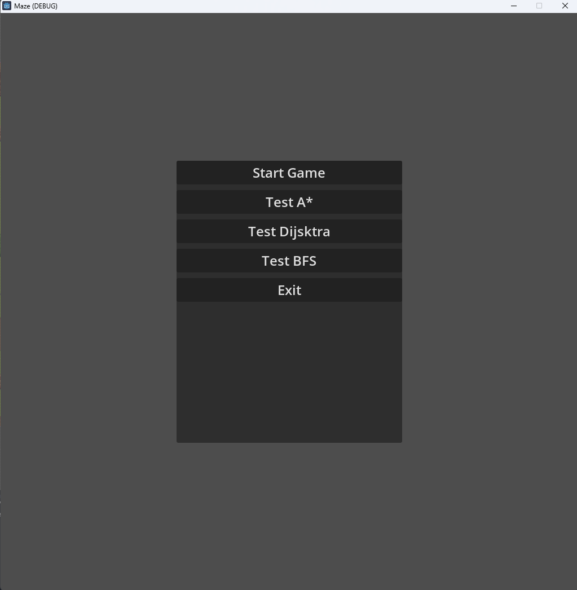
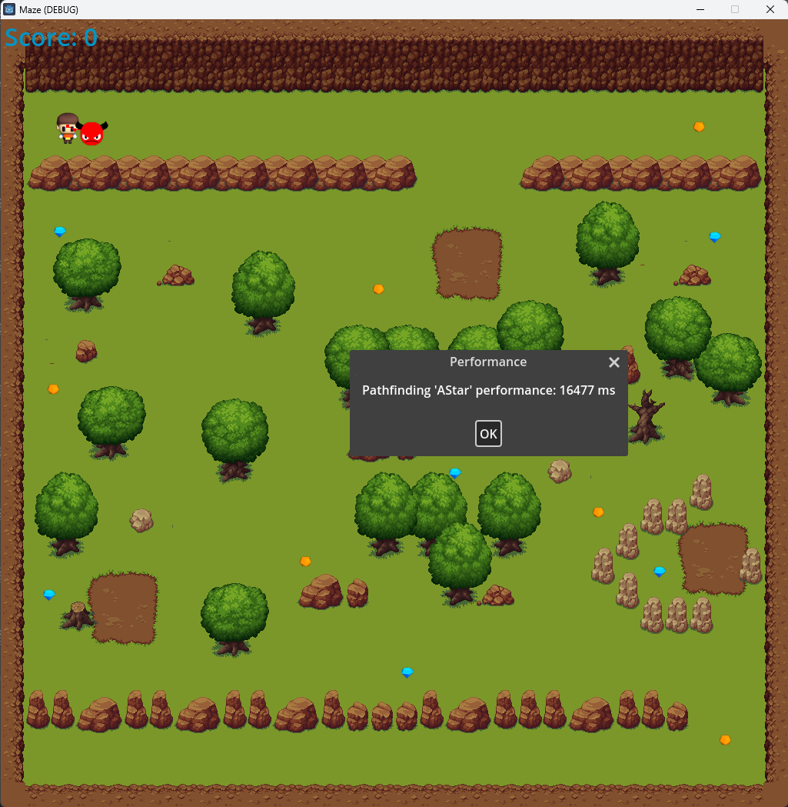
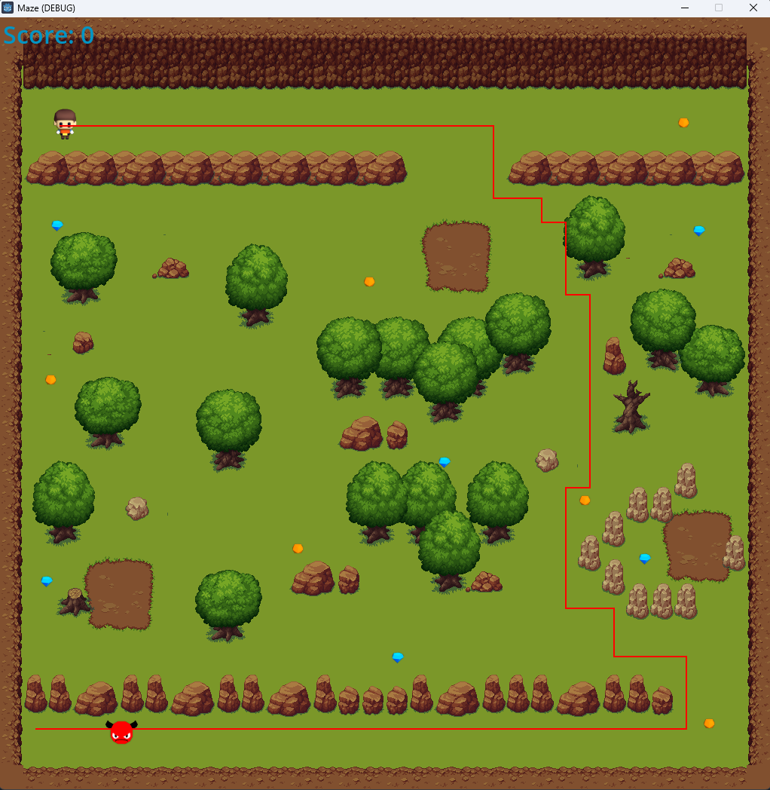
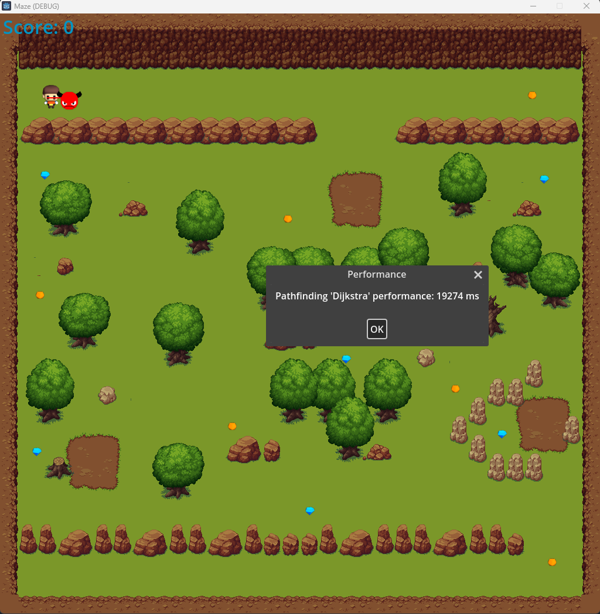
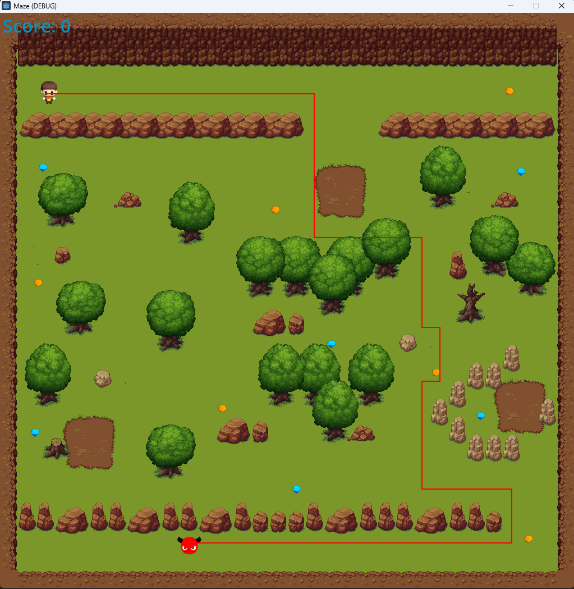
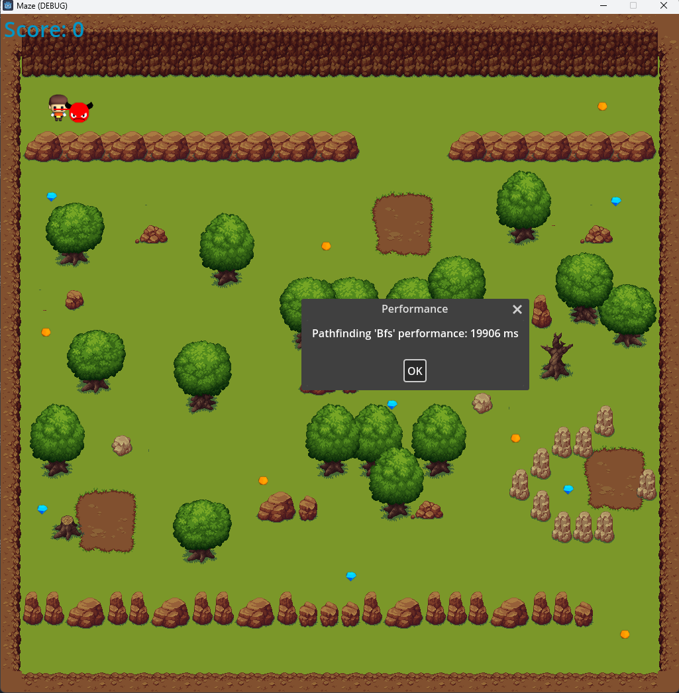

# Maze 2D Game
Sample 2D maze game built using Godot Engine 4.x and C#.
Demonstrated how to integrate custom pathfinding algorithms in 2D grid-based games.
Also, demonstrated how to use the Godot Engine's built-in navigation2D node for pathfinding.
Compared the performance of custom pathfinding algorithms with the built-in navigation2D node that uses A* algorithm under the hood.

## Features
- Custom pathfinding algorithms such as Breadth First Search, Dijkstra's Algorithm, and A* Algorithm.
- Built-in navigation2D node that uses A* algorithm.
- Tilemap-based maze generation.
- Player movement using keyboard input.
- Enemy movement using pathfinding algorithms.
- Collectible gems.
- High quality C# code with detailed comments.

## Game Objective
Collect all gems in the maze and don't get caught by the enemy.

## Keyboard Controls
- Arrow or WASD keys: Move player.
- Esc key: Exit to the main menu.
- Tilda key: Toggle debug mode.

## Credits
- Sukhrob Ilyosbekov
- Shashwath Udaya Kumar
- Reena Sajad Hyder
- Reemaa Sajad Hyder

## Screenshots
### Main Menu

### Game Scene

### Test A* Algorithm Scene

### Test Dijkstra's Algorithm Scene

### Test Breadth First Search Scene

